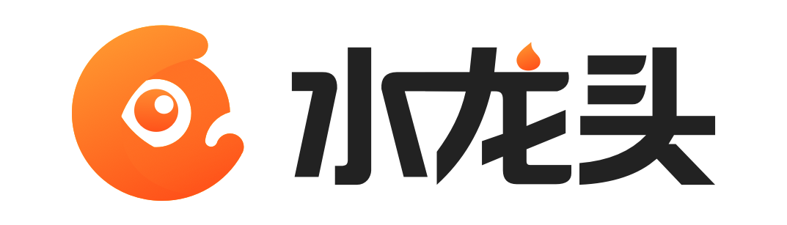
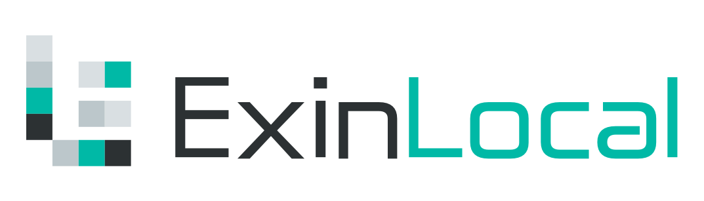

<p align="center"></p>
<p align="center">
<a href="README.zh-CN.md"></a>
</p>

## Webhook

**Webhook** is a message callback service based on [Mixin Messenger](https://mixin.one). You can apply Webhook to any service that you want to forward messages to Mixin Messenger. Webhook currently support the following websocket messages types: `PLAIN_TEXT`, `PLAIN_CONTACT`, `APP_BUTTON_GROUP` and `APP_CARD`. You can check the details of **Websocket Messages** in [Mixin Developer](https://developers.mixin.one/api/beta-mixin-message/websocket-messages/).

## Features

- **Security**: Webhook only forward messages and does not save message content.
- **Privacy**: Webhook works in group chats of Mixin Messenger, the group chats support end-to-end encryption.
- **Easy to use**: A single line of code for message forwarding.
- **Open source**: Webhook is open source , you can use the source code to build your own services.

## Usage

Search `7000000012` in [Mixin Messenger](https://mixin.one/messenger) and add **[Webhook](https://mixin.one/codes/4d792128-1db8-4baf-8d90-d0d8189a4a7e)** as contact.

Invite Webhook and somebody who want to receive message to a group in Mixin Messenger. Open Webhook in the group, you can see the access token. Note that the access token is only available for the owner of the group. Also you can send message to yourself when you authorize to Webhook and when you open Webhook you can see the personal access token.

Example:

``` bash
$ curl https://webhook.exinwork.com/api/send?access_token=YOUR_ACCESS_TOKEN \
-XPOST -H 'Content-Type: application/json' \
-d '{"category":"PLAIN_TEXT","data":"Hello World!"}'
```

You can check the sample code in [Webhook Samples](https://github.com/ExinOne/webhook-samples), which support Go, PHP, Python and Shell.

## Contact

- Wechat：ThorbJ
- Mixin: 1070593
- Email ：thorb@exin.one

## Based On

<p align="left">
  <a target="_blank" href="https://mixin.one">
    
  </a>
</p>

## Application

<p align="left">
  <a target="_blank" href="https://exinone.com">
    
  </a>
  &nbsp;
    <a target="_blank" href="https://exinone.com">
    
  </a>
  &nbsp;
  <a target="_blank" href="https://exinpool.com">
    
  </a>
  &nbsp;
  <a target="_blank" href="https://support.exinlocal.com">
    
  </a>
</p>
