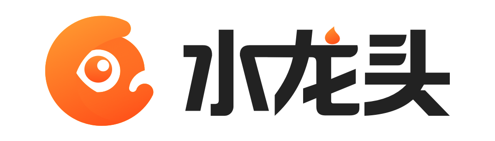
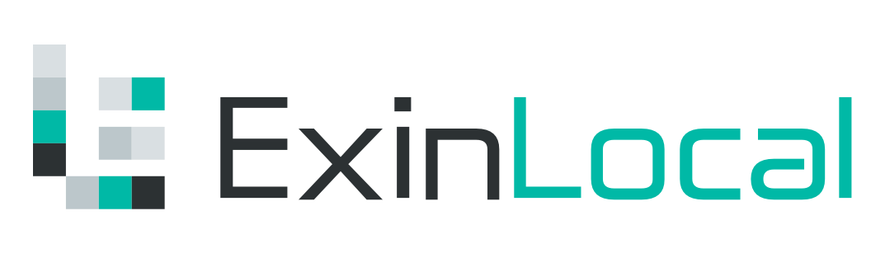

<p align="center"></p>
<p align="center">
<a href="README.md"></a>
</p>

## Webhook

Webhook 是一个基于 [Mixin Messenger](https://mixin.one) 的消息回调服务。您可以将 Webhook 应用在任何您想转发消息到 Mixin Messenger 的服务上。Webhook 目前支持以下的消息类型：`PLAIN_TEXT`、`PLAIN_CONTACT`、`APP_BUTTON_GROUP` 和 `APP_CARD`。您可以在 [Mixin Developer](https://developers.mixin.one/api/beta-mixin-message/websocket-messages/) 中查看 **Websocket Messages** 的详细信息。

## 优势

* **安全**：Webhook 只做消息转发，不保存消息内容；
* **隐私**：Webhook 在 Mixin Messenger 群聊中工作，群聊支持端对端加密；
* **便捷**：一行代码即可实现消息转发；
* **开源**：Webhook 开源，您可以使用源代码构建属于自己的服务。

## 使用

在 [Mixin Messenger](https://mixin.one/messenger) 搜索 `7000000012`，然后添加 **[Webhook](https://mixin.one/codes/4d792128-1db8-4baf-8d90-d0d8189a4a7e)** 为联系人。

在 Mixin Messenger 邀请 Webhook 以及想接受消息的人到一个小群，在群组里打开 Webhook 机器人，然后您可以获取到 access token。注意只有群组所有者才有权限获取到 access token。同时您可以发送消息给您自己，当您授权给 Webhook 然后打开 Webhook，您可以查看到您的私人 access token。

示例代码：

```
curl https://webhook.exinwork.com/api/send?access_token=YOUR_ACCESS_TOKEN -XPOST -H 'Content-Type: application/json' -d '{"category":"PLAIN_TEXT","data":"Hello World!"}'
```

您可以在 [Webhook Samples](https://github.com/ExinOne/webhook-samples) 查看示例代码，支持 Go、PHP、Python 和 Shell。

## 联系我们

- 微信：ThorbJ
- Mixin：1070593
- 邮箱：thorb@exin.one

## 基于

<p align="left">
  <a target="_blank" href="https://mixin.one">
    
  </a>
</p>

## 谁在用

<p align="left">
  <a target="_blank" href="https://exinone.com">
    
  </a>
  &nbsp;
    <a target="_blank" href="https://exinone.com">
    
  </a>
  &nbsp;
  <a target="_blank" href="https://exinpool.com">
    
  </a>
  &nbsp;
  <a target="_blank" href="https://support.exinlocal.com">
    
  </a>
</p>
